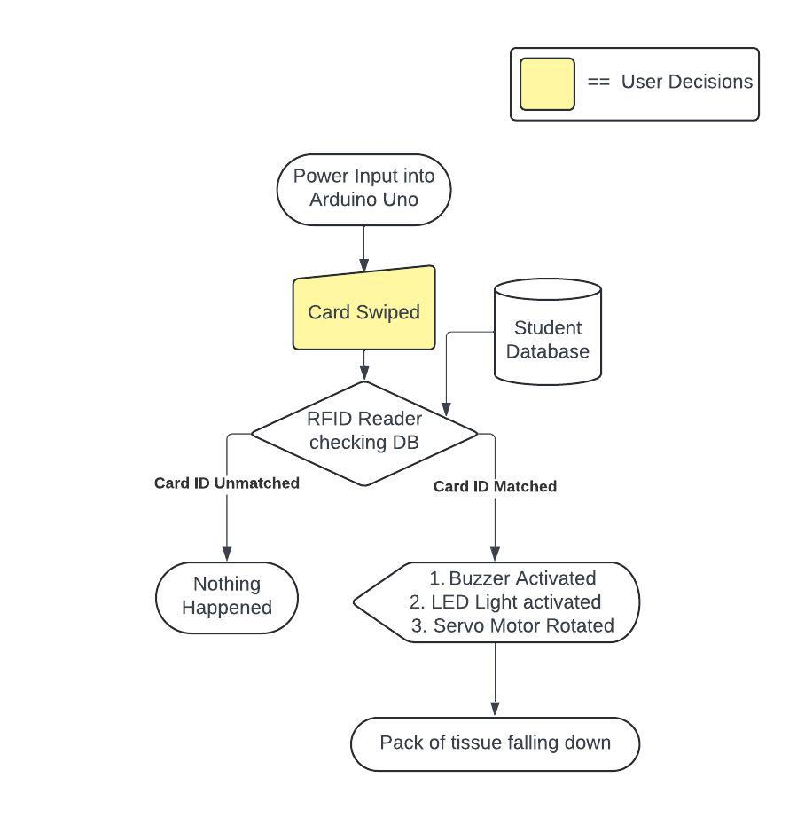

# WipeWise

### What is WipeWise?
**WipeWise** is the tissue vending machine using a student card instead of cash to reduce the number of people who use it incorrectly, for instance a lawbreaker who throwing, playing, or wasting. Also this project was created in a computer and robotics class as the final project of grade 12, semester 1.
 
**WipeWise** คือเครื่องจำหน่ายกระดาษทิชชู่ที่ใช้บัตรนักเรียนแทนเงินสด เพื่อลดจำนวนผู้ใช้งานอย่างไม่ถูกต้อง เช่น การขว้างปา การเล่น หรือการสิ้นเปลือง นอกจากนี้ โปรเจ็กต์นี้ยังถูกสร้างขึ้นในชั้นเรียนคอมพิวเตอร์และหุ่นยนต์เป็นโปรเจ็กต์สุดท้ายของชั้นมัธยมศึกษาปีที่ 6 ภาคเรียนที่ 1
 
 
 
### Method
After the user swipes the student card, the RFID Reader will read that if the card info is matched, it will input their info in history because it is easier to find a lawbreaker. After that, the Buzzer and LED Light will activate, and the Servo Motor will rotate 180 degrees, so a small pack of tissue can fall down.
 
หลังจากที่ผู้ใช้รูดบัตรนักเรียน RFID Reader จะอ่านว่าหากข้อมูลบัตรตรงกัน เครื่องจะป้อนข้อมูลของนักเรียนลงในประวัติเพื่อให้ค้นหาผู้กระทำความผิดได้ง่ายขึ้น หลังจากนั้น Buzzer และ LED Light จะทำงาน และมอเตอร์เซอร์โวจะหมุน 180 องศา ทำให้กระดาษทิชชู่ขนาดเล็กหล่นลงมาได้
 
 
 
### Component List
- Servo Motor 1 pcs
- RFID Reader 1 pcs
- Buzzer 1 pcs 
- LED Light 1 pcs
- Arduino Uno

### Used Language/Tools

  &nbsp;
  &nbsp;
  

### Flowchart 

  

   

   

### Demo Video

https://github.com/user-attachments/assets/a89c8bdc-938d-43ce-be13-421c0aae39cd

If video isn't available, I have also uploaded a video on YouTube, and the link is provided below. 
[Testing Preview Here](https://youtube.com/shorts/vR_VhIOKlVw)
