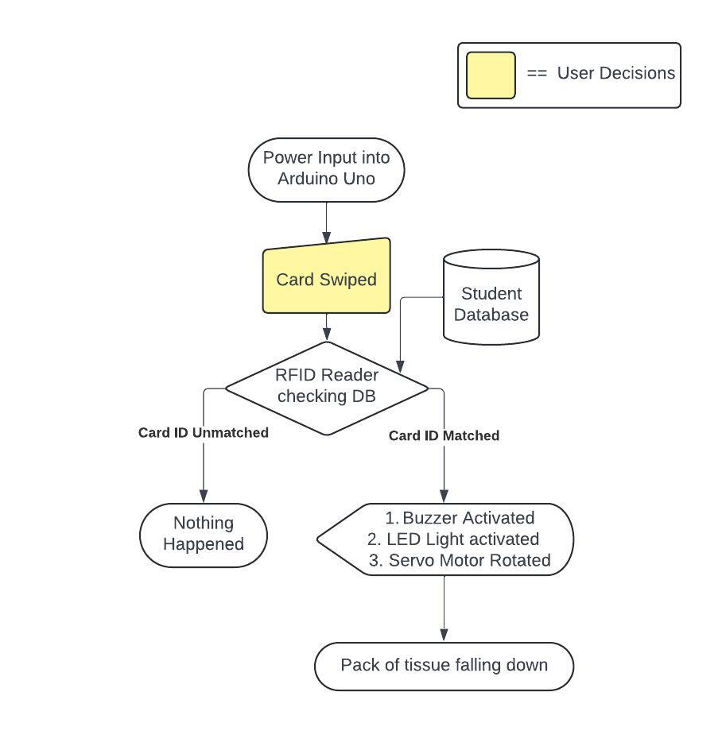
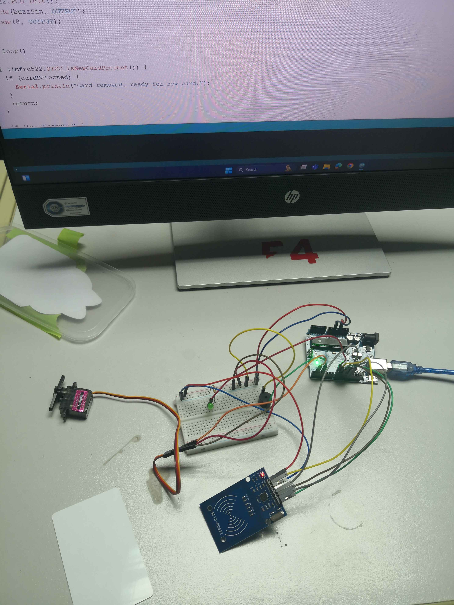
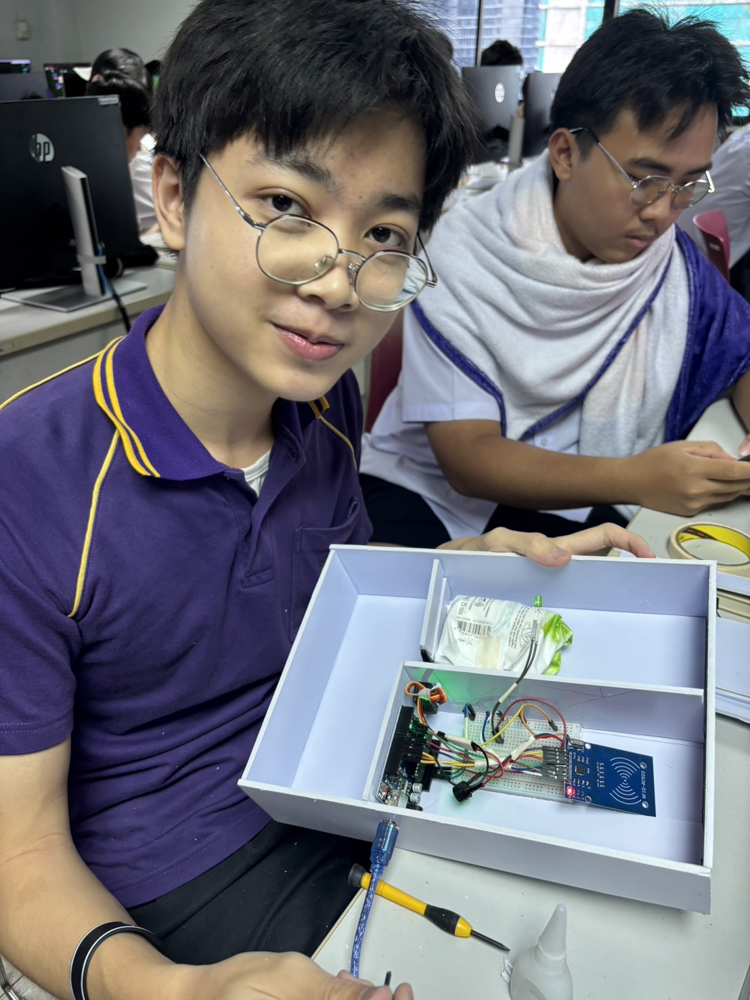
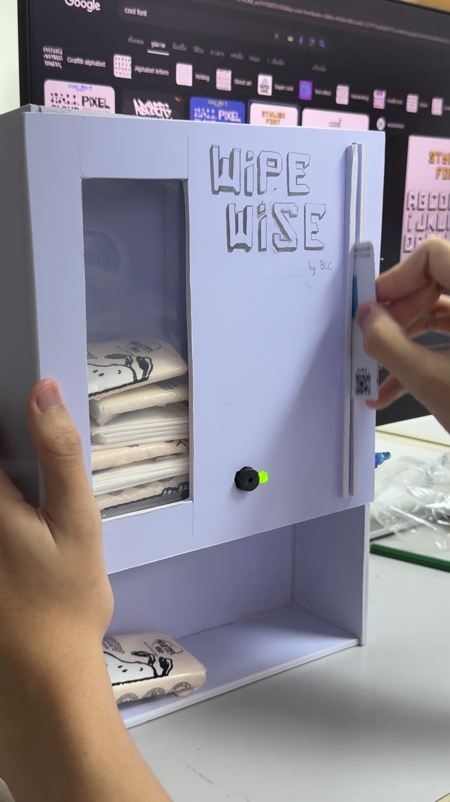

# 🧻 WipeWise

  
  

## ✨ Overview

WipeWise is a smart tissue vending machine that replaces traditional cash payments with **student ID card authentication**.

The project was developed as the **final project** for my **Grade 12 Computer and Robotics** course. Its primary goal is to reduce tissue waste by ensuring that only authorized users can access the dispenser while maintaining a usage history for accountability.

By combining RFID technology with Arduino, the system automatically verifies a student's identity, records the transaction, and dispenses a single pack of tissues through a servo-driven mechanism.

## ⚙️ How It Works

The vending machine uses an **RFID reader** to authenticate student ID cards.

When a valid card is scanned:

1. The RFID reader verifies the student's information.
2. The user's information is recorded in the usage history.
3. The LED indicator and buzzer provide visual and audio feedback.
4. The servo motor rotates **180°** to release one pack of tissues.
5. The mechanism automatically returns to its initial position, ready for the next user.

This approach encourages responsible use while making it easier to identify misuse when necessary.

## 🧩 Components

| Component   | Quantity |
| ----------- | -------: |
| Arduino Uno |        1 |
| RFID Reader |        1 |
| Servo Motor |        1 |
| Buzzer      |        1 |
| LED         |        1 |

## 🖥 Built With

<table>
<tr align="center">
<td width="120">

</td>

<td width="120">

</td>
</tr>

<tr align="center">
<td>Arduino</td>
<td>C</td>
</tr>
</table>

## 🔄 System Flow

## 📸 Development Process

<table>
<tr>
<td align="center" width="33%">

 <b>Internal Wiring</b>
</td>

<td align="center" width="33%">

 <b>Internal Mechanism</b>
</td>

<td align="center" width="33%">

 <b>Complete Prototype</b>
</td>
</tr>
</table>

## 🎥 Demonstration

[A demonstration video is included in this repository.](https://github.com/user-attachments/assets/c5f65b8a-0a29-40f0-97c5-12ac33027478)

If the embedded video is unavailable, you can also watch it on YouTube:

**https://youtube.com/shorts/jsc1isLf9dE**

